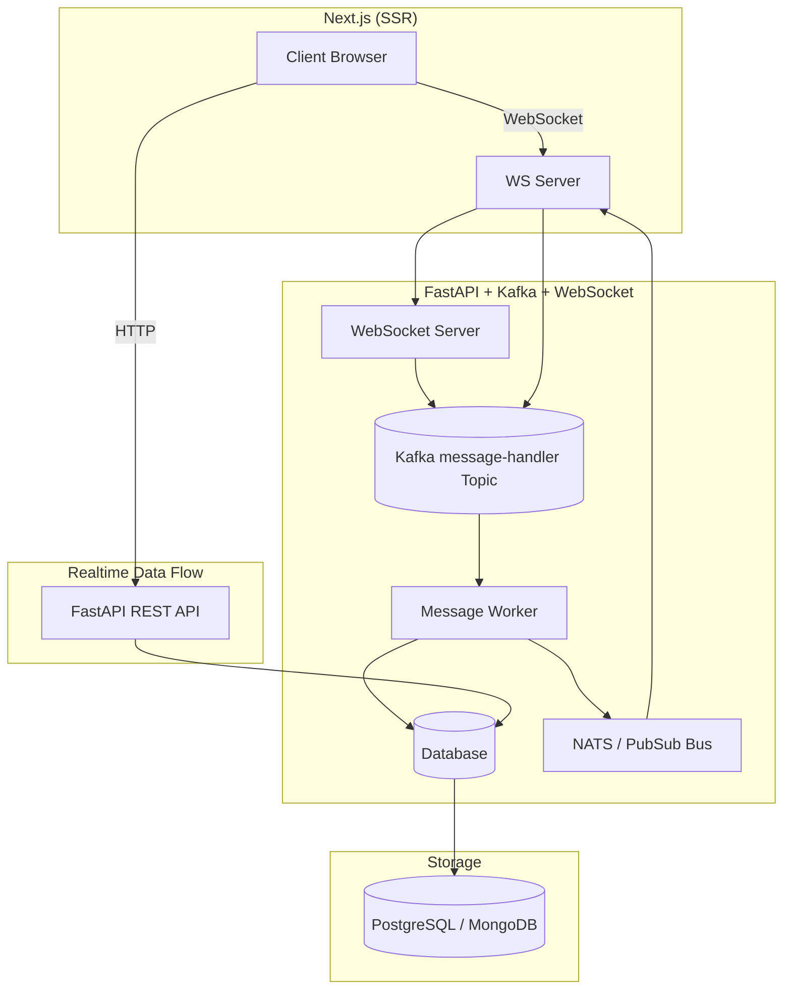

# Feedback with Real-time Chat App

A full-stack real-time feedback chat application built using WebSocket, Kafka consumers, and a monorepo architecture.

---

## 🚀 Features

- Real-time chat / feedback functionality  
- Kafka consumers for background processing  
- WebSocket server for live updates  
- Monorepo structure for frontend + backend  
- Docker compose setup for development & production  

---

## 📁 Repository Structure

```bash
.
├── .github/                         # CI/CD workflows
├── kafka_consumer_1/                # Kafka consumer service 1
├── kafka_consumer_2/                # Kafka consumer service 2
├── reach-backend/                   # Backend API services
├── reach-frontend/                  # Frontend application
├── ws-server/                       # WebSocket server
├── docker-compose.dev.yml           # Dev Docker compose
├── docker-compose.prod.yml          # Production Docker compose
└── docker-compose.staging.yml       # Staging Docker compose

# 💬 Feedback with Real-Time Chat App

A **real-time employee feedback and chat management system** where managers can create projects or groups, invite employees, exchange feedback, rate performance, and communicate in real time — built using **FastAPI**, **Next.js (SSR)**, **Kafka**, and **WebSockets**.

---

## 🧠 Overview

This platform enables two-way interaction between **managers** and **employees** in real time.  
Managers can create **projects/groups**, invite employees via **expirable links**, and exchange **messages**, **ratings**, and **feedback**.

> Built with **FastAPI** backend, **Next.js SSR** frontend, **Kafka** for event streaming, and **WebSocket** for real-time updates.

---

## 🏗️ System Architecture


